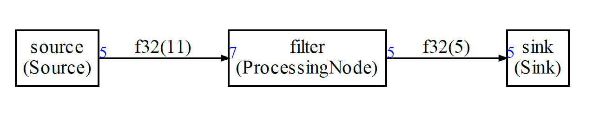

# Example 1

In this example we will see how to describe the following graph:



The framework is coming with some default blocks. But for this example, we will create new blocks. The blocks that you to create need must be described with a simple Python class and a corresponding simple C++ class.

## The steps

It looks complex because there is a lot of information but the process is always the same:

1. You define new kind of nodes in the Python. They define the IOs, sample types and amount of data read/written on each IO
2. You create instance of those new kind of Nodes
3. You connect them in a graph and generate a schedule
4. In your AppNodes.h file , you implement the new kind of nodes with C++ templates:
   1. The class is generally not doing a lot : defining the IOs and the function to call when run
5. If you need more control on the initialization, it is possible to pass additional arguments to the node constructors and to the scheduler function.

## Python code

Let's analyze the file `graph.py` in the `example1` folder. This file is describing the graph and the node and is calling the Python functions to generate the dot and C++ files.


First, we add some path so that the example can find the sdf packages when run from example1 folder.

```python
import sys

sys.path.append("../..")

from sdf import *
```


Then, we describe the new kind of blocks that we need : Source, ProcessingNode and Sink.

```python
class Sink(GenericSink):
    def __init__(self,name,theType,inLength):
        GenericSink.__init__(self,name)
        self.addInput("i",theType,inLength)

    @property
    def typeName(self):
        return "Sink"
```

When creating a new kind of node (here a sink) we always need to do 2 things:

- Add a type in typeName. It will be used to create objects in C++ or Python. So it must be a valid C++ or Python class name ;
- Add inputs and outputs. The convention is that an input is named "i" and output "o". When there are several inputs they are named "ia", "ib" etc ...
- For a sink you can only add an input. So the function addOutput is not available.
- The constructor is taking a length and a type. It is used to create the io
- When there are several inputs or outputs, they are ordered using alphabetical order.
It is important to know what is the ID of the corresponding IO in the C code.

The definition of a new kind of Source is very similar:

```python
class Source(GenericSource):
    def __init__(self,name,theType,inLength):
        GenericSource.__init__(self,name)
        self.addOutput("o",theType,inLength)

    @property
    def typeName(self):
        return "Source"
```


Then for the processing node, we could define it directly. But, often there will be several Nodes in a graph, so it is useful to create a new Node blocks and inherit from it.

```python
class Node(GenericNode):
    def __init__(self,name,theType,inLength,outLength):
        GenericNode.__init__(self,name)
        self.addInput("i",theType,inLength)
        self.addOutput("o",theType,outLength)
```


Note that this new kind of block has no type. It just has an input and an output.

Now we can define the Processing node:

```python
class ProcessingNode(Node):
    @property
    def typeName(self):
        return "ProcessingNode"
```

We just define its type.

Once it is done, we can start creating instance of those nodes. We will also need to define the type for the samples (float32 in this example). The functions and constants are defined in `sdf.schedule.types`.

```python
floatType=CType(F32)
```

Now, we can define the nodes for the graph:

```python
src=Source("source",floatType,5)
b=ProcessingNode("filter",floatType,7,5)
sink=Sink("sink",floatType,5)
```

For each node, we define :

- The name (name of variable in C++ or Python generated code)
- The type for the inputs and outputs 
- The numbers of samples consumed / produced on the io
- Inputs are listed first for the number of samples

For `ProcessingNode` we are adding additional arguments to show how it is possible to add other arguments for initializing a node in the generated code:

```python
b.addLiteralArg(4)
b.addLiteralArg("Test")
b.addVariableArg("someVariable")
```


The C++ for object of type `ProcessingNode` are taking 3 arguments in addition to the io. For those, arguments we are passing an int, a string and a variable name.

Now that the nodes have been created, we can create the graph and connect the nodes:

```python
g = Graph()

g.connect(src.o,b.i)
g.connect(b.o,sink.i)
```

Then, before we generate a schedule, we can define some configuration:

```python
conf=Configuration()
conf.debugLimit=1
```

Since it is streamed based processing, the schedule should run forever. For testing, we can limit the number of iterations. Here the generated code will run just one iteration of the schedule.

This configuration object can be used as argument of the scheduling function (named parameter config) and must be used as argument of the code generating functions.

There are other fields for the configuration:

- `dumpFIFO` : Will dump the output FIFOs content after each execution of the node (the code generator is inserting calls to the FIFO dump function)
- `displayFIFOSizes` : During the computation of the schedule, the Python script is displaying the evolution of the FIFO lengths.
- `schedName` : The name of the scheduler function (`scheduler` by default)
- `cOptionalArgs` and pyOptionalArgs for passing additional arguments to the scheduling function
- `prefix` to prefix the same of the global buffers
- `memoryOptimization` : Experimental. It is attempting to reuse buffer memory and share it between several FIFOs 
- `pathToSDFModule` : Path to the Python SDF module so that the generated Python code can find it
- `codeArray` : Experimental. When a schedule is very long, representing it as a sequence of function calls is not good for the code size of the generated solution. When this option is enabled, the schedule is described with an array. It implies that the pure function calls cannot be inlined any more and are replaced by new nodes which are automatically generated.

In the example 1, we are passing a variable to initialize the node of type ProcessingNode. So, it would be great if this variable was an argument of the scheduler function. So we define:

```python
conf.cOptionalArgs="int someVariable"
```

This will be added after the error argument of the scheduling function.

Once we have a configuration object, we can start to compute the schedule and generate the code:

```python
sched = g.computeSchedule()
print("Schedule length = %d" % sched.scheduleLength)
print("Memory usage %d bytes" % sched.memory)
```

A schedule is computed. We also display:

- The length of the schedule
- The total amount of memory used by all the FIFOs

We could also have used:

```python
sched = g.computeSchedule(config=conf)
```

to use the configuration object if we needed to dump the FIFOs lengths.

Now, that we have a schedule, we can generate the graphviz and the C++ code:

```python
with open("test.dot","w") as f:
    sched.graphviz(f)
    
sched.ccode("generated",conf)
```

The C++ code will be generated in the `example1` folder `generated` : sched.cpp

## The C++ code

The C++ code generated in`scheduler.cpp` and `scheduler.h` in `generated` folder is relying on some additional files which must be provided by the developer:

- custom.h : to define some custom initialization or `#define` used by the code
- AppNodes.h to define the new C++ blocks 

Let's look at custom.h first:

### custom.h

```c++
#ifndef _CUSTOM_H_


#endif _CUSTOM_H_
```

It is empty in `example1`. This file can be used to include or define some variables and constants used by the network.

### AppNodes.h

All the new nodes defined in the Python script must also be defined in the C++ code. They are very similar to the Python code but a bit more verbose.

```c++
template<typename IN, int inputSize>
class Sink: public GenericSink<IN, inputSize>
{
public:
    Sink(FIFOBase<IN> &src):GenericSink<IN,inputSize>(src){};

    int run()
    {
        IN *b=this->getReadBuffer();
        printf("Sink\n");
        for(int i=0;i<inputSize;i++)
        {
            std::cout << (int)b[i] << std::endl;
        }
        return(0);
    };

};
```


The `Sink` is inheriting from the `GenericSink`. In the constructor we pass the fifos : input fifos first (output fifos are always following the input fifos when they are used. For a sink, we have no output fifos).

In the template parameters ,we pass the type/length for each io : input first then followed by outputs (when there are some outputs).

The node must have a run function which is implementing the processing.

Here we just dump to stdout the content of the buffer. The amount of data read by `getReadBuffer` is defined in the `GenericSink` and is coming from the template parameter.

The `Source` definition is very similar:

```C++
template<typename OUT,int outputSize>
class Source: GenericSource<OUT,outputSize>
{
public:
    Source(FIFOBase<OUT> &dst):GenericSource<OUT,outputSize>(dst),mCounter(0){};

    int run(){
        OUT *b=this->getWriteBuffer();

        printf("Source\n");
        for(int i=0;i<outputSize;i++)
        {
            b[i] = (OUT)mCounter++;
        }
        return(0);
    };

    int mCounter;

};
```

In this example, the source is just counting. And we only have output fifos.

`getWriteBuffer` and `getReadBuffer` must always be called on the io ports to ensure that
the FIFOs are not overflowing or underflowing (**even if the run function is doing nothing**).
No error detection is done because the static schedule is ensuring that no error will occur if you don't forget to call the functions in your nodes.

Finally, the processing node:

```C++
template<typename IN, int inputSize,typename OUT,int outputSize>
class ProcessingNode: public GenericNode<IN,inputSize,OUT,outputSize>
{
public:
    ProcessingNode(FIFOBase<IN> &src,FIFOBase<OUT> &dst,int,const char*,int):GenericNode<IN,inputSize,OUT,outputSize>(src,dst){};

    int run(){
        printf("ProcessingNode\n");
        IN *a=this->getReadBuffer();
        OUT *b=this->getWriteBuffer();
        b[0] =(OUT)a[3];
        return(0);
    };

};
```

The processing node is (very arbitrary) copying the value at index 3 to index 0 of the output.

The processing node is taking 3 arguments after the FIFOs in the constructor.

### scheduler.cpp

The generated code is first including the needed headers:

```C++
#include "arm_math.h"
#include "custom.h"
#include "GenericNodes.h"
#include "AppNodes.h"
#include "scheduler.h"
```

- CMSIS-DSP header
- Custom definitions
- Generic nodes from `GenericNodes.h`
- Application nodes
- scheduler API

Then, the generated code is defining the buffers for the FIFOs:

```C++
/***********

FIFO buffers

************/

#define FIFOSIZE0 11
float32_t buf0[FIFOSIZE0]={0};

#define FIFOSIZE1 5
float32_t buf1[FIFOSIZE1]={0};
```

Then, the scheduling function is generated:

```C++
uint32_t scheduler(int *error,int someVariable) {
```

A value `<0` in `error` means there was an error during the execution.

The returned valued is the number of schedules fully executed when the error occurred.

The scheduling function is starting with a definition of some variables used for debug and statistics:

```C++
int sdfError=0;
uint32_t nbSchedule=0;
int32_t debugCounter=1;
```

Then, it is followed with a definition of the FIFOs:

```C++
/*
Create FIFOs objects
*/
FIFO<float32_t,FIFOSIZE0> fifo0(buf0);
FIFO<float32_t,FIFOSIZE1> fifo1(buf1);
```

Then, the nodes are created and connected to the FIFOs:

```C++
/* 
Create node objects
*/
ProcessingNode<float32_t,7,float32_t,5> filter(fifo0,fifo1,4,"Test",someVariable);
Sink<float32_t,5> sink(fifo1);
Source<float32_t,5> source(fifo0);
```

And finally, the function is entering the scheduling loop:

```C++
 while((sdfError==0) && (debugCounter > 0))
 {
       nbSchedule++;

       sdfError = source.run();
       CHECKERROR;
```

`CHECKERROR` is a macro defined in `Sched.h`. It is just testing if `sdfError < 0` and breaking out of the loop if it is the case.

Since an application may want to use several SDF graphs, the name of the `sched` and `customInit` functions can be customized in the `configuration` object on the Python side:

```python
config.schedName = "sched"
```

A prefix can also be added before the name of the global FIFO buffers:

```python
config.prefix="bufferPrefix"
```

## Summary

It looks complex because there is a lot of information but the process is always the same:

1. You define new kind of nodes in the Python. They define the IOs, type and amount of data read/written on each IO
2. You create instance of those new kind of Nodes
3. You connect them in a graph and generate a schedule
4. In you AppNodes.h, you implement the new kind of nodes with a C++ template:
   1. It is generally defining the IO and the function to call when run
5. If you need more control on the initialization, it is possible to pass additional arguments to the nodes constructors and to the scheduler function.
