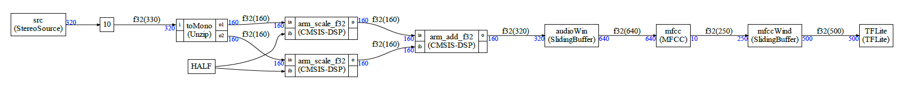

# Example 2

Please refer to [Example 1](example1.md) for the details about how to create a graph and the C++ support classes.

In this example. we are just analyzing a much more complex example to see some new features:

- Delay
- CMSIS-DSP functions
- Some default nodes : sliding buffer 

The graph is:



It is much more complex:

- First we have a source delayed by 10 samples ;
- Then this stereo source is split into left/right samples using the default block Unzip 
- The samples are divided by 2 using a CMSIS-DSP function
- The node HALF representing a constant is introduced (constant arrays are also supported)
- The two streams are added using a CMSIS-DSP function
- Then we have a sliding buffer 
- A block representing a MFCC (a fake MFCC)
- Another sliding buffer
- An a block representing TensorFlow Lite for Micro (a fake TFLite node)

Note that those blocks (MFCC, TFLite) are doing nothing in this example. It is just to illustrate a more complex example that someone may want to experiment with for keyword spotting.

Examples 5 and 6 are showing how to use the CMSIS-DSP MFCC.

The new features compared to `example1` are:

- Delay
- CMSIS-DSP function
- Constant node 
- SlidingBuffer

Let's look at all of this:

## Delay

```python
g.connectWithDelay(src.o, toMono.i,10)
```


To add a delay on a link between 2 nodes, you just use the `connectWithDelay` function. Delays can be useful for some graphs which are not schedulable. They are implemented by starting the schedule with a FIFO which is not empty but contain 0 samples.

## CMSIS-DSP function

Some CMSIS-DSP functions are automatically made available to the framework : mainly the functions with no state and which are pure stream based computation : Basic math functions etc ...

To create a CMSIS-DSP node, just use:

```python
sa=Dsp("scale",floatType,blockSize)
```

The corresponding CMSIS-DSP function will be named: `arm_scale_f32`

The code generated in `sched.cpp` will not require any C++ class, It will look like:

```C++
{
  float32_t* i0;
  float32_t* o2;
  i0=fifo2.getReadBuffer(160);
  o2=fifo4.getWriteBuffer(160);
  arm_scale_f32(i0,HALF,o2,160);
  sdfError = 0;
}
```


## Constant node 

In the case of scaling, we need to connect the scaling factor to the node. So we need a constant node. 

A constant node is defined as:

```python
half=Constant("HALF")
```


In the C++ code, HALF is expected to be a value defined in custom.h

In the Python generated code, it would be in custom.py 

Constant values are not involved in the scheduling (they are ignored) and they have no io. So, to connect to a constant node we do:

```python
g.connect(half,sa.ib)
```

There is no "o", "oa" suffixes for the constant node half.

## SlidingBuffer 

Sliding buffers and OverlapAndAdd are used  a lot so they are provided by default.

In Python, it can be used with:

```python
audioWindow=SlidingBuffer("audioWin",floatType,640,320)
```

The first length (`640`) is the window size and the second length (`320`) is the overlap. So, in this case we have an overlap of 50%

There is no C++ class to write for this since it is provided by default by the framework.

It is named `SlidingBuffer` but not `SlidingWindow` because no multiplication with a window is done. It must be implemented with another block as will be demonstrated in the [example 3](example3.md)

