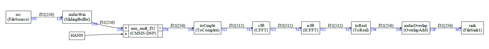

# Example 3

This example is implementing a working example with FFT. The graph is:



The example is:

- Providing a file source which is reading a source file and then padding with zero 
- A sliding window 
- A multiplication with a Hann window 
- A conversion to/from complex
- Use of CMSIS-DSP FFT/IFFT 
- Overlap and add 
- File sink writing the result into a file 

The new feature s compared to previous examples are:

- The constant array HANN 
- The CMSIS-DSP FFT 

## Constant array

It is like in example 2 where the constant was a float.

Now, the constant is an array:

```python
hann=Constant("HANN")
```


In custom.h, this array is defined as:

```C++
extern const float32_t HANN[256];
```


## CMSIS-DSP FFT

The FFT node cannot be created using a `Dsp` node in Python because FFT is requiring specific initializations. So, a Python class and C++ class must be created :


```python
class CFFT(GenericNode):
    def __init__(self,name,inLength):
        GenericNode.__init__(self,name)

        self.addInput("i",floatType,2*inLength)
        self.addOutput("o",floatType,2*inLength)

    @property
    def typeName(self):
        return "CFFT"
```

Look at the definition of the inputs and outputs : The FFT is using complex number so the ports have twice the number of float samples. The argument of the constructor is the FFT length in complex sample.

We suggest to use as arguments of the blocks a number of samples which is meaningful for the blocks and use the lengths in standard data type (f32, q31 ...) when defining the IO.

So here, the number of complex samples is used as arguments. But the IO are using the number of floats required to encode those complex numbers.

The corresponding C++ class is:

```C++
template<typename IN, int inputSize,typename OUT,int outputSize>
class CFFT: public GenericNode<IN,inputSize,OUT,outputSize>
{
public:
    CFFT(FIFOBase<IN> &src,FIFOBase<OUT> &dst):
    GenericNode<IN,inputSize,OUT,outputSize>(src,dst){
         arm_status status;
         status=arm_cfft_init_f32(&sfft,inputSize>>1);
    };

    int run(){
        IN *a=this->getReadBuffer();
        OUT *b=this->getWriteBuffer();
        memcpy((void*)b,(void*)a,outputSize*sizeof(IN));
        arm_cfft_f32(&sfft,b,0,1);
        return(0);
    };

    arm_cfft_instance_f32 sfft;

};
```

It is verbose but not difficult. The constructor is initializing the CMSIS-DSP FFT instance and connecting to the FIFO (through GenericNode).


The run function is applying the arm_cfft_f32. Since this function is modifying the input buffer, there is a memcpy. It is not really needed here. The read buffer can be modified by the CFFT. It will just make it more difficult to debug if you'd like to inspect the content of the FIFOs.


This node is provided in sdf/nodes/cpp so no need to define it. You can just use it by including the right headers.

It can be used by just doing in your AppNodes.h file :

```c++
#include "CFFT_F32.h"
```

From Python side it would be:

```python
from sdf.nodes.py.CFFTF32 import *
```

