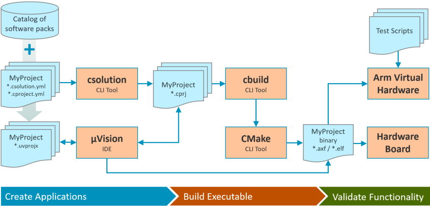

\mainpage Overview

CMSIS-Build is now replaced with the **[CMSIS-Toolbox](https://github.com/Open-CMSIS-Pack/devtools/tree/main/tools)** that is a set of tools for creating and building projects that are based on software packs. It also contains tools that help to create software packs.

# Components of CMSIS-Toolbox {#Components_of_CMSIS_Toolbox}
The **[CMSIS-Toolbox](https://github.com/Open-CMSIS-Pack/devtools/tree/main/tools)** is developed under the [Linaro Open-CMSIS-Pack](https://www.open-cmsis-pack.org/) project and contains these tools:

- **cpackget** download, add and remove software packs.
- **csolution** to create and manage complex applications with user source files and content from software packs
- **cbuild** controls the build process that translates a project to a executable binary image.
- **packgen** to create a software pack from a CMake based software repository.
- **packchk** to validate a software pack

The **[CMSIS-Toolbox](https://github.com/Open-CMSIS-Pack/devtools/tree/main/tools)** can be used as stand-alone tools with command line interface (CLI) but will be integrated into several other Arm tool solutions such as:

- **[Arm Virtual Hardware](https://www.arm.com/virtual-hardware)** to manage the build process in CI workflows.
- **[Keil Studio](https://www.keil.arm.com)** as integral part of the project management.
- **[Keil MDK](https://www.keil.com/mdk5/)** to provide CLI tools for project generation.

# Development Workflow {#Development_Workflow}

The following diagram shows the development workflow using the CMSIS-Toolbox.  

A solution that manages several related projects and projects can be composed using an intuitive `*.yml` format. This solution and project files are then translated using **csolution** CLI tool to the `*.CPRJ` project file format.

The individual `*.CPRJ` project files can be imported to an IDE or by using **cbuild** translated into executable binary images.

The \ref cprjFormat_pg describes the `*.CPRJ` project file format that is used by **cbuild**.

# Revision History {#Revision_History}

Version       | Description
:-------------|:---------------------------------
replaced by   | **[CMSIS-Toolbox](https://github.com/Open-CMSIS-Pack/devtools/tree/main/tools)** now contains the **cbuild** (aka CMSIS-Build) CLI tool.
0.10.0 (beta) | CMake back-end and support for more Cortex-M processors including ArmV8.1M architecture.
0.9.0 (beta)  | Support for multiple compilers and commands for layer management
0.1.0 (alpha) | Release for alpha review
