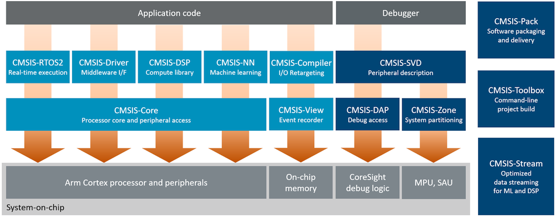

\mainpage Introduction

The <b>CMSIS</b> is a set of tools, APIs, frameworks, and work flows that help to simplify software re-use, reduce the
learning curve for microcontroller developers, speed-up project build and debug, and thus reduce the time to market for new
applications.

CMSIS started as a vendor-independent hardware abstraction layer Arm&reg; Cortex&reg;-M based processors and was later
extended to support entry-level Arm Cortex-A based processors. To simplify access, CMSIS defines generic tool interfaces and
enables consistent device support by providing simple software interfaces to the processor and the peripherals.

CMSIS has been created to help the industry in standardization. It enables consistent software layers and device support
across a wide range of development tools and microcontrollers. CMSIS is not a huge software layer that introduces overhead
and does not define standard peripherals. The silicon industry can therefore support the wide variations of Arm Cortex
processor-based devices with this common standard.

CMSIS Components {#cmsis_components}
================



<br/>
**CMSIS Base Software Components**

<div class="tiles">
  <div class="tile">
    <span class="tileh h2">CMSIS-Core (M)</span><span style="color:var(--page-foreground-color);">Standardized API for Cortex-M processor cores</span><span><a href="https://arm-software.github.io/CMSIS_6/latest/Core/html/index.html">Guide</a> | <a href="https://github.com/ARM-software/CMSIS_6">GitHub</a></span>
  </div>
  <div class="tile">
    <span class="tileh h2">CMSIS-Core (A)</span><span style="color:var(--page-foreground-color);">Standardized API for Cortex-A5/A7/A9 cores</span><span><a href="https://arm-software.github.io/CMSIS_6/latest/Core_A/html/index.html">Guide</a> | <a href="https://github.com/ARM-software/CMSIS_6">GitHub</a></span>
  </div>
<div class="tile">
    <span class="tileh h2">CMSIS-Driver</span><span style="color:var(--page-foreground-color);">Generic peripheral driver interfaces for middleware</span><span><a href="https://arm-software.github.io/CMSIS_6/latest/Driver/html/index.html">Guide</a> | <a href="https://github.com/ARM-software/CMSIS_6">GitHub</a></span>
  </div>
  <div class="tile">
   <span class="tileh h2">CMSIS-RTOS2</span><span style="color:var(--page-foreground-color);">Common API for real-time operating systems</span><span><a href="https://arm-software.github.io/CMSIS_6/latest/RTOS2/html/index.html">Guide</a> | <a href="https://github.com/ARM-software/CMSIS_6">GitHub</a></span>
  </div>
</div>

<br/>
**CMSIS Extended Software Components**

<div class="tiles">
  <div class="tile">
    <span class="tileh h2">CMSIS-DSP</span><span style="color:var(--page-foreground-color);">Collection of optimized compute library for embedded systems</span><span style="align-self:end;"><a href="https://arm-software.github.io/CMSIS-DSP/latest/">Guide</a> | <a href="https://github.com/ARM-software/CMSIS-DSP">GitHub</a></span>
  </div>
  <div class="tile">
    <span class="tileh h2">CMSIS-NN</span><span style="color:var(--page-foreground-color);">Collection of efficient and optimized neural network kernels</span><span style="align-self:end;"><a href="https://arm-software.github.io/CMSIS-NN/latest/">Guide</a> | <a href="https://github.com/ARM-software/CMSIS-NN">GitHub</a></span>
  </div>
  <div class="tile">
    <span class="tileh h2">CMSIS-View</span><span style="color:var(--page-foreground-color);">Event Recorder and Component Viewer technology</span><span style="align-self:end;"><a href="https://arm-software.github.io/CMSIS-View/latest/">Guide</a> | <a href="https://github.com/ARM-software/CMSIS-View">GitHub</a></span>
  </div>
  <div class="tile">
    <span class="tileh h2">CMSIS-Compiler</span><span style="color:var(--page-foreground-color);">Retarget I/O functions of the standard C run-time library</span><span style="align-self:end;"><a href="https://arm-software.github.io/CMSIS-Compiler/latest/">Guide</a> | <a href="https://github.com/ARM-software/CMSIS-Compiler">GitHub</a></span>
  </div>
</div>

<br/>
**CMSIS Tools**

<div class="tiles">
  <div class="tile">
    <span class="tileh h2">CMSIS-Toolbox</span><span style="color:var(--page-foreground-color);">A set of command-line tools to work with software packs</span><span style="align-self:end;"><a href="...">Guide</a> | <a href="https://github.com/Open-CMSIS-Pack/cmsis-toolbox">GitHub</a></span>
  </div>
  <div class="tile">
    <span class="tileh h2">CMSIS-Stream</span><span style="color:var(--page-foreground-color);">Peripheral description of a device for debug view</span><span style="align-self:end;"><a href="...">Guide</a> | <a href="...">GitHub</a></span>
  </div>
  <div class="tile">
    <span class="tileh h2">CMSIS-DAP</span><span style="color:var(--page-foreground-color);">Firmware for debug units interfacing to CoreSight Debug Access Port</span><span style="align-self:end;"><a href="...">Guide</a> | <a href="...">GitHub</a></span>
  </div>
  <div class="tile">
    <span class="tileh h2">CMSIS-Zone</span><span style="color:var(--page-foreground-color);">Defines methods to describe system resources and to partition them</span><span style="align-self:end;"><a href="...">Guide</a> | <a href="https://github.com/ARM-software/CMSIS-Zone">GitHub</a></span>
  </div>
</div>

<br/>
**CMSIS Specifications**

<div class="tiles">
  <div class="tile">
    <span class="tileh h2">CMSIS-Pack</span><span style="color:var(--page-foreground-color);">Delivery mechanism for software components and device/board support</span><span style="align-self:end;"><a href="https://open-cmsis-pack.github.io/Open-CMSIS-Pack-Spec/main/html/index.html">Guide</a> | <a href="https://github.com/Open-CMSIS-Pack/Open-CMSIS-Pack-Spec">GitHub</a></span>
  </div>
  <div class="tile">
    <span class="tileh h2">CMSIS-SVD</span><span style="color:var(--page-foreground-color);">Peripheral description of a device for debug view</span><span style="align-self:end;"><a href="...">Guide</a> | <a href="...">GitHub</a></span>
  </div>
</div>

<br/>

CMSIS-...                                    | Target Processors       | Software Components
:--------------------------------------------|:------------------------|:-------------
[**Core(M)**](../../Core/html/index.html)    | All Cortex-M, SecurCore | Standardized API and basic run-time system for the Cortex-M processor core and peripherals.
[**Core(A)**](../../Core_A/html/index.html)  | Cortex-A5/A7/A9         | Standardized API and basic run-time system for the Cortex-A5/A7/A9 processor core and peripherals.
[**RTOS2**](../../RTOS2/html/index.html)    |  All Cortex-M, Cortex-A5/A7/A9 | Common API for real-time operating systems that enables software components that can work across multiple RTOS systems.
[**Driver**](../../Driver/html/index.html)   |  All Cortex             | Generic peripheral driver interfaces for middleware. Connects microcontroller peripherals with middleware that implements for example communication stacks, file systems, sensor interfaces.
[**DSP**](https://github.com/arm-software/cmsis-dsp)      | All Cortex-M and Cortex-A | Collection of optimized compute library for embedded systems.
[**NN**](https://github.com/arm-software/cmsis-nn)        | All Cortex-M              | Collection of efficient neural network kernels optimized for performance and memory footprint.
[**Compiler**](https://github.com/arm-software/cmsis-compiler)  | All Cortex-M        | Retarget I/O functions of the standard C run-time library.
[**View**](https://github.com/arm-software/cmsis-view)    | All Cortex-M              | Event Recorder technology and component viewer previously available only in Keil MDK.
**Tools**  | | **Specifications and Development Tools**
[**Pack**](https://open-cmsis-pack.github.io/Open-CMSIS-Pack-Spec/main/html/index.html) | All Cortex-M     | Delivery mechanism for software components, device support, and board support.  
[**Toolbox**](https://github.com/Open-CMSIS-Pack/cmsis-toolbox) | All Cortex-M     | A set of command-line tools to work with software packs including project build with various compilation tools.
[**Stream**](https://github.com/arm-software/cmsis-stream) | All Cortex-M and Cortex-A    | Provides methods, interfaces, and tools for data block streaming between processing steps of a DSP/ML application.  
[**SVD**](https://arm-software.github.io/CMSIS_5/SVD/html/index.html) | All Cortex-M and Cortex-A    | Peripheral description of a device that can be used to create peripheral awareness in debuggers or CMSIS-Core header files.
[**DAP**](https://arm-software.github.io/CMSIS_5/DAP/html/index.html) | All Cortex Processors    | Firmware for a debug unit that interfaces to the CoreSight Debug Access Port.
[**Zone**](https://arm-software.github.io/CMSIS_5/Zone/html/index.html) | All Cortex-M and Cortex-A    | Defines methods to describe system resources and to partition these resources into multiple projects and execution areas.

> **Note:**
> 
> - The **CMSIS Base** components (in this software pack and [repository](https://github.com/ARM-software/CMSIS_6)) are: **Core(A)**, **Core(M)**, **Driver**, and **RTOS2**. The remaining CMSIS components are in different software packs and repositories.

Benefits {#benefits}
========

The benefits of the CMSIS are:

 - CMSIS reduces the learning curve, development costs, and time-to-market. Developers can write software quicker through a
   variety of easy-to-use, standardized software interfaces.
 - Consistent software interfaces improve the software portability and re-usability. Generic software libraries and
   interfaces provide consistent software framework.
 - It provides interfaces for debug connectivity, debug peripheral views, software delivery, and device support to reduce
   time-to-market for new microcontroller deployment.
 - It allows to use the compiler of your choice, as it is compiler independent and thus supported by mainstream compilers.
 - It enhances program debugging with peripheral information for debuggers and ITM channels for printf-style output.
 - CMSIS is delivered in CMSIS-Pack format which enables fast software delivery, simplifies updates, and enables consistent
   integration into development tools.
 - CMSIS-Zone will simplify system resource and partitioning as it manages the configuration of multiple processors, memory
   areas, and peripherals.
 - Continuous integration is common practice for most software developers nowadays. CMSIS-Build supports these workflows
   and makes continuous testing and validation easier.


Development {#development}
===========

CMSIS is defined in close cooperation with various silicon and software vendors and provides a common approach to interface
to peripherals, real-time operating systems, and middleware components. It is intended to enable the combination of software
components from multiple vendors.

CMSIS is open-source and collaboratively developed. The repository for the base components is [github.com/Arm-software/CMSIS_6](https://github.com/ARM-software/CMSIS_6).

CodingRules {#coding_rules}
===========

The CMSIS uses the following essential coding rules and conventions:

 - Compliant with ANSI C (C99) and C++ (C++03).
 - Uses ANSI C standard data types defined in \b <stdint.h>.
 - Variables and parameters have a complete data type.
 - Expressions for \c \#define constants are enclosed in parenthesis.
 - Conforms to MISRA 2012 (but does not claim MISRA compliance). MISRA rule violations are documented.

In addition, the CMSIS recommends the following conventions for identifiers:

 - **CAPITAL** names to identify Core Registers, Peripheral Registers, and CPU Instructions.
 - **CamelCase** names to identify function names and interrupt functions.
 - **Namespace_** prefixes avoid clashes with user identifiers and provide functional groups (i.e. for peripherals, RTOS, or DSP Library).

The CMSIS is documented within the source files with:
 \li Comments that use the C or C++ style.
 \li <a href="https://www.doxygen.nl/" target="_blank">Doxygen</a> compliant <b>function comments</b> that provide:
    - brief function overview.
    - detailed description of the function.
    - detailed parameter explanation.
    - detailed information about return values.

Doxygen	comment example:

``` c
/**
 * @brief  Enable Interrupt in NVIC Interrupt Controller
 * @param  IRQn  interrupt number that specifies the interrupt
 * @return none.
 * Enable the specified interrupt in the NVIC Interrupt Controller.
 * Other settings of the interrupt such as priority are not affected.
 */
```

Validation {#validation}
==========

The various components of CMSIS are validated using mainstream compilers. To get a diverse coverage,  
Arm Compiler v6 (based on LLVM front-end) and GCC are used in the various tests. For each component, the
section **Validation** describes the scope of the various verification steps.

CMSIS components are compatible with a range of C and C++ language standards. The CMSIS components comply with the
[Application Binary Interface (ABI) for the Arm Architecture](https://github.com/ARM-software/abi-aa). This ensures 
C API interfaces that support inter-operation between various toolchains.

As CMSIS defines API interfaces and functions that scale to a wide range of processors and devices, the scope of
the run-time test coverage is limited. However, several components are validated using dedicated test suites
(<a href="../../Driver/html/driverValidation.html">CMSIS-Driver</a>,
<a href="../../RTOS/html/rtosValidation.html">CMSIS-RTOS v1</a>, and
<a href="../../RTOS2/html/rtosValidation.html">CMSIS-RTOS v2</a>).

The CMSIS source code is checked for MISRA C:2012 conformance using PC-Lint. MISRA deviations are documented with
reasonable effort, however Arm does not claim MISRA compliance as there is today for example no guideline enforcement
plan. The CMSIS source code is not checked for MISRA C++:2008 conformance as there is a risk that it is incompatible
with C language standards, specifically warnings that may be generated by the various C compilers.

License {#License}
=======

CMSIS is provided free of charge by Arm under the <a href="https://raw.githubusercontent.com/ARM-software/CMSIS_6/main/LICENSE">Apache 2.0 License</a>.

CMSIS Software Pack {#CMSIS_Pack}
===================

The CMSIS Base Components itself and all other CMSIS software components are delivered in [CMSIS-Pack](https://open-cmsis-pack.github.io/Open-CMSIS-Pack-Spec/main/html/index.html) format. The <b>ARM::CMSIS</b> pack contains
the following:

File/Directory     |Content
:------------------|:-------------------
**ARM.CMSIS.pdsc** |Package description file in CMSIS-Pack format.
**LICENSE**        |CMSIS License Agreement (Apache 2.0)
**CMSIS**          |\ref cmsis_components "CMSIS components" (see also table below)
**Device**         |CMSIS reference implementations of Arm Cortex processor based devices

CMSIS Directory
---------------

Directory                 |Content
:-------------------------|:-----------
**Core**                  |User code templates for <a href="../../Core/html/index.html"><b>CMSIS-Core (Cortex-M)</b></a> related files, referenced in ARM.CMSIS.pdsc.
**Core_A**                |User code templates for <a href="../../Core_A/html/index.html"><b>CMSIS-Core (Cortex-A)</b></a> related files, referenced in ARM.CMSIS.pdsc.
**Driver**                |Header files for the <a href="../../Driver/html/index.html"><b>CMSIS-Driver</b></a> peripheral interface API.
\b RTOS2                  |<a href="../../RTOS2/html/index.html"><b>CMSIS-RTOS Version 2</b></a> API definition.

Revision History {#revision_history}
================

The following table shows the overall high-level history of the various CMSIS releases.
In addition, each CMSIS component has its own release history:

- <a href="../../Core/html/core_revisionHistory.html"><b>Core (Cortex-M) Revision History</b></a>
- <a href="../../Core_A/html/rev_histCoreA.html"><b>Core (Cortex-A) Revision History</b></a>
- <a href="../../Driver/html/driver_revisionHistory.html"><b>Driver Revision History</b></a>
- <a href="../../DSP/html/ChangeLog_pg.html"><b>DSP Revision History (Change Log)</b></a>
- <a href="../../NN/html/ChangeLog_pg.html"><b>NN Revision History (Change Log)</b></a>
- <a href="../../RTOS/html/rtos_revisionHistory.html"><b>RTOS v1 Revision History</b></a>
- <a href="../../RTOS2/html/rtos_revisionHistory.html"><b>RTOS v2 Revision History</b></a>
- <a href="../../Pack/html/pack_revisionHistory.html"><b>Pack Revision History</b></a>
- <a href="../../SVD/html/svd_revisionHistory.html"><b>SVD Revision History</b></a>
- <a href="../../DAP/html/dap_revisionHistory.html"><b>DAP Revision History</b></a>
- <a href="../../Zone/html/zone_revisionHistory.html"><b>Zone Revision History</b></a>

<table class="cmtable" summary="Revision History">
    <tr>
      <th>Version</th>
      <th>Description</th>
    </tr>
    <tr>
      <td>5.9.0</td>
      <td>
       - CMSIS-Core(M): 5.6.0 (see revision history for details)
         - Arm Cortex-M85 cpu support
         - Arm China STAR-MC1 cpu support
         - Updated system_ARMCM55.c
       - CMSIS-Core(A): 1.2.1 (unchanged)
       - CMSIS-Driver: 2.8.0 (unchanged)
       - CMSIS-DSP: 1.10.0 (see revision history for details)
       - CMSIS-NN: 3.1.0 (see revision history for details)
         - Support for int16 convolution and fully connected for reference implementation
         - Support for DSP extension optimization for int16 convolution and fully connected
         - Support dilation for int8 convolution
         - Support dilation for int8 depthwise convolution
         - Support for int16 depthwise conv for reference implementation including dilation
         - Support for int16 average and max pooling for reference implementation
         - Support for elementwise add and mul int16 scalar version
         - Support for softmax int16 scalar version
         - Support for SVDF with 8 bit state tensor
       - CMSIS-RTOS2: 2.1.3 (unchanged)
          - RTX 5.5.4 (see revision history for details)
       - CMSIS-Pack: deprecated (moved to Open-CMSIS-Pack)
       - CMSIS-Build: deprecated (moved to CMSIS-Toolbox in Open-CMSIS-Pack)
       - CMSIS-SVD: 1.3.9 (see revision history for details)
       - CMSIS-DAP: 2.1.1 (see revision history for details)
         - Allow default clock frequency to use fast clock mode
       - CMSIS-Zone: 1.0.0 (unchanged)
       - Devices
         - Support for Cortex-M85
       - Utilities
          - SVDConv 3.3.42
          - PackChk 1.3.95
      </td>
    </tr>
    <tr>
      <td>5.8.0</td>
      <td>
        - CMSIS-Build 0.10.0 (beta)
          - Enhancements (see revision history for details)
        - CMSIS-Core (Cortex-M) 5.5.0
          - Updated GCC LinkerDescription, GCC Assembler startup
          - Added ARMv8-M Stack Sealing (to linker, startup) for toolchain ARM, GCC
          - Changed C-Startup to default Startup.
        - CMSIS-Core (Cortex-A) 1.2.1
        - CMSIS-Driver 2.8.0 (unchanged)
        - CMSIS-DSP 1.9.0
          - Purged pre-built libs from Git
        - CMSIS-NN 3.0.0
          - Major interface change for functions compatible with TensorFlow Lite for Microcontroller
          - Added optimization for SVDF kernel
          - Improved MVE performance for fully Connected and max pool operator
          - NULL bias support for fully connected operator in non-MVE case(Can affect performance)
          - Expanded existing unit test suite along with support for FVP
        - CMSIS-RTOS 2.1.3 (unchanged)
          - RTX 5.5.3 (see revision history for details)
        - CMSIS-Pack 1.7.2
          - Support for Microchip XC32 compiler
          - Support for Custom Datapath Extension
        - CMSIS-SVD 1.3.3 (unchanged)
        - CMSIS-DAP 2.0.0 (unchanged)
        - CMSIS-Zone 1.0.0 (unchanged)
        - Devices
        - Utilities
          - SVDConv 3.3.35
          - PackChk 1.3.89
      </td>
    </tr>
    <tr>
      <td>5.7.0</td>
      <td>
        - CMSIS-Build 0.9.0 (beta)
          - Draft for CMSIS Project description (CPRJ)
        - CMSIS-Core (Cortex-M) 5.4.0
          - Cortex-M55 cpu support
          - Enhanced MVE support for Armv8.1-MML
          - Fixed device config define checks.
          - L1 Cache functions for Armv7-M and later
        - CMSIS-Core (Cortex-A) 1.2.0
          - Fixed GIC_SetPendingIRQ to use GICD_SGIR
          - Added missing DSP intrinsics
          - Reworked assembly intrinsics: volatile, barriers and clobber
        - CMSIS-Driver 2.8.0
          - Added VIO API 0.1.0 (preview)
        - CMSIS-DSP 1.8.0
          - Added new functions and function groups
          - Added MVE support
        - CMSIS-NN 1.3.0
          - Added MVE support
          - Further optimizations for kernels using DSP extension
        - CMSIS-RTOS 2.1.3 (unchanged)
          - RTX 5.5.2 (see revision history for details)
        - CMSIS-Pack 1.6.3
          - deprecating all types specific to cpdsc format. Cpdsc is replaced by Cprj with dedicated schema.
        - CMSIS-SVD 1.3.3 (unchanged)
        - CMSIS-DAP 2.0.0 (unchanged)
        - CMSIS-Zone 1.0.0
        - Devices
          - ARMCM55 device
          - ARMv81MML startup code recognizing __MVE_USED macro
          - Refactored vector table references for all Cortex-M devices
          - Reworked ARMCM* C-StartUp files.
          - Include L1 Cache functions in ARMv8MML/ARMv81MML devices
        - Utilities
          Attention: Linux binaries moved to Linux64 folder!
          - SVDConv 3.3.35
          - PackChk 1.3.89
      </td>
    </tr>
    <tr>
      <td>5.6.0</td>
      <td>
        - CMSIS-Core (Cortex-M) 5.3.0
          - Added provisions for compiler-independent C startup code.
        - CMSIS-Core (Cortex-A) 1.1.4
          - Fixed __FPU_Enable.
        - CMSIS-Driver 2.7.1
          - Finalized WiFi Interface API 1.0.0
        - CMSIS-DSP 1.7.0 (see revision history for details)
          - New Neon versions of f32 functions
          - Compilation flags for FFTs
        - CMSIS-NN 1.2.0 (unchanged)
        - CMSIS-RTOS1 1.03 (unchanged)
          - RTX 4.82.0 (see revision history for details)
        - CMSIS-RTOS 2.1.3 (unchanged)
          - RTX 5.5.1 (see revision history for details)
        - CMSIS-Pack 1.6.0 (unchanged)
        - CMSIS-SVD 1.3.3 (unchanged)
        - CMSIS-DAP 2.0.0 (unchanged)
        - CMSIS-Zone 0.12.0 (preview)
          - Completely reworked
        - Devices
          - Generalized C startup code for all Cortex-M family devices.
          - Updated Cortex-A memory regions and system configuration files.
        - Utilities
          - SVDConv 3.3.27
          - PackChk 1.3.82 (unchanged)
      </td>
    </tr>
    <tr>
      <td>5.5.1</td>
      <td>
        - CMSIS-Core (Cortex-M) 5.2.1
          - Fixed compilation issue in cmsis_armclang_ltm.h
        - CMSIS-Core (Cortex-A) 1.1.3 (unchanged)
        - CMSIS-Driver 2.7.0 (unchanged)
        - CMSIS-DSP 1.6.0 (unchanged)
        - CMSIS-NN 1.1.0 (unchanged)
        - CMSIS-RTOS 2.1.3 (unchanged)
          - RTX 5.5.0 (unchanged)
        - CMSIS-Pack 1.6.0 (unchanged)
        - CMSIS-SVD 1.3.3 (unchanged)
        - CMSIS-DAP 2.0.0 (unchanged)
        - CMSIS-Zone 0.9.0 (unchanged)
      </td>
    </tr>
    <tr>
      <td>5.5.0</td>
      <td>
        - CMSIS-Core (Cortex-M) 5.2.0
          - Reworked Stack/Heap configuration for ARM startup files.
          - Added Cortex-M35P device support.
          - Added generic Armv8.1-M Mainline device support.
        - CMSIS-Core (Cortex-A) 1.1.3 Minor fixes.
        - CMSIS-DSP 1.6.0
          - reworked DSP library source files
            - added macro ARM_MATH_LOOPUNROLL
            - removed macro UNALIGNED_SUPPORT_DISABLE
            - added const-correctness
            - replaced SIMD pointer construct with memcopy solution
            - replaced macro combination `CMSIS_INLINE __STATIC_INLINE` with `__STATIC_FORCEINLINE`
          - reworked DSP library documentation
          - Changed DSP folder structure
            - moved DSP libraries to ./DSP/Lib
          - moved DSP libraries to folder ./DSP/Lib
          - ARM DSP Libraries are built with ARMCLANG
          - Added DSP Libraries Source variant
        - CMSIS-NN 1.1.0 (unchanged)
        - CMSIS-Driver 2.7.0
          - Added WiFi Interface API 1.0.0-beta
          - Added custom driver selection to simplify implementation of new CMSIS-Driver
        - CMSIS-RTOS 2.1.3
          - RTX 5.5.0 (see revision history)
        - CMSIS-Pack 1.6.0
        - CMSIS-SVD 1.3.3 (unchanged)
        - CMSIS-DAP 2.0.0 (unchanged)
        - CMSIS-Zone 0.9.0 (Preview)
        - Devices
          - Added Cortex-M35P and ARMv81MML device templates.
          - Fixed C-Startup Code for GCC (aligned with other compilers)
            - Moved call to SystemInit before memory initialization.
        - Utilities
          - SVDConv 3.3.25
          - PackChk 1.3.82
      </td>
    </tr>
    <tr>
      <td>5.4.0</td>
      <td>
        - CMSIS-Core (Cortex-M) 5.1.2 Minor fixes and slight enhancements, e.g. beta for Cortex-M1.
        - CMSIS-Core (Cortex-A) 1.1.2 Minor fixes.
        - CMSIS-Driver 2.6.0 (unchanged)
        - CMSIS-DSP 1.5.2 (unchanged)
        - CMSIS-NN 1.1.0 Added new math function (see revision history)
        - CMSIS-RTOS 2.1.3 Relaxed interrupt usage.
          - RTX 5.4.0 (see revision history)
        - CMSIS-Pack 1.5.0 (unchanged)
        - CMSIS-SVD 1.3.3 (unchanged)
        - CMSIS-DAP 2.0.0 (unchanged)
        - CMSIS-Zone 0.0.1 (unchanged)
      </td>
    </tr>
    <tr>
      <td>5.3.0</td>
      <td>
        - CMSIS-Core (Cortex-M) 5.1.1
        - CMSIS-Core (Cortex-A) 1.1.1
        - CMSIS-Driver 2.6.0 (unchanged)
        - CMSIS-DSP 1.5.2 (unchanged)
        - CMSIS-NN 1.0.0 Initial contribution of Neural Network Library.
        - CMSIS-RTOS 2.1.2 (unchanged)
        - CMSIS-Pack 1.5.0 (unchanged)
        - CMSIS-SVD 1.3.3 (unchanged)
        - CMSIS-DAP 2.0.0 Communication via WinUSB to achieve high-speed transfer rates.
        - CMSIS-Zone 0.0.1 (unchanged)
      </td>
    </tr>
    <tr>
      <td>5.2.0</td>
      <td>
        - CMSIS-Core (Cortex-M) 5.1.0 MPU functions for ARMv8-M, cmsis_iccarm.h replacing cmsis_iar.h
        - CMSIS-Core (Cortex-A) 1.1.0 cmsis_iccarm.h, additional physical timer access functions
        - CMSIS-Driver 2.6.0 Enhanced CAN and NAND driver interface.
        - CMSIS-DSP 1.5.2 Fixed diagnostics and moved SSAT/USST intrinsics to CMSIS-Core.
        - CMSIS-RTOS 2.1.2 Relaxed some ISR-callable restrictions.
        - CMSIS-Pack 1.5.0 (unchanged)
        - CMSIS-SVD 1.3.3 (unchanged)
        - CMSIS-DAP 1.2.0 (unchanged)
        - CMSIS-Zone 0.0.1 (unchanged)
      </td>
    </tr>
    <tr>
      <td>5.1.1</td>
      <td>
        - CMSIS-Core (Cortex-M) (unchanged)
        - CMSIS-Core (Cortex-A) (unchanged)
        - CMSIS-Driver 2.05 (unchanged)
        - CMSIS-DSP 1.5.2 (unchanged)
        - CMSIS-RTOS 2.1.1 Fixed RTX5 pre-built libraries for Cortex-M.
        - CMSIS-Pack 1.5.0 (unchanged)
        - CMSIS-SVD 1.3.3 (unchanged)
        - CMSIS-DAP 1.1.0 (unchanged)
        - CMSIS-Zone 0.0.1 (unchanged)
      </td>
    </tr>
    <tr>
      <td>5.1.0</td>
      <td>
        - CMSIS-Core (Cortex-M) 5.0.2 several minor corrections and enhancements
        - CMSIS-Core (Cortex-A) 1.0.0 implements a basic run-time system for Cortex-A5/A7/A9
        - CMSIS-Driver 2.05 status typedef made volatile
        - CMSIS-DSP 1.5.2 fixed GNU Compiler specific diagnostics
        - CMSIS-RTOS 2.1.1 added support for Cortex-A5/A7/A9 to RTX5
        - CMSIS-Pack 1.5.0 added SDF format specification
        - CMSIS-SVD 1.3.3 (unchanged)
        - CMSIS-DAP 1.1.0 (unchanged)
        - CMSIS-Zone 0.0.1 (Preview) format to describe system resources and tool for partitioning of resources
      </td>
    </tr>
    <tr>
      <td>5.0.1</td>
      <td>
        - CMSIS-Core 5.0.1 added __PACKED_STRUCT macro and uVisor support
        - CMSIS-Driver 2.05 updated all typedefs related to status now being volatile.
        - CMSIS-DSP 1.5.1 added ARMv8M DSP libraries
        - CMSIS-RTOS 2.1.0 added support for critical and uncritical sections
        - CMSIS-Pack 1.4.8 add Pack Index File specification
        - CMSIS-SVD 1.3.3 (unchanged)
        - CMSIS-DAP 1.1.0 (unchanged)
      </td>
    </tr>
	<tr>
      <td>5.0.0</td>
      <td>
        Added support for: <a href="http://www.arm.com/products/processors/instruction-set-architectures/armv8-m-architecture.php" target="_blank"><b>ARMv8-M architecture</b></a> including TrustZone for ARMv8-M and Cortex-M23, Cortex-M33 processors
        - CMSIS-Core (Cortex-M) 5.0.0 added support for ARMv8-M and Cortex-M23, Cortex-M33 processors
        - CMSIS-Driver 2.04.0 (unchanged)
        - CMSIS-DSP 1.4.9 minor corrections and performance improvements
        - CMSIS-RTOS 2.0.0 new API with RTX 5.0.0 reference implementation and corrections in RTX 4.8.2
        - CMSIS-Pack 1.4.4 introducing CPDSC project description
        - CMSIS-SVD 1.3.3 several enhancements and rework of documentation
        - CMSIS-DAP 1.1.0 (unchanged)
      </td>
    </tr>
    <tr>
      <td>4.5.0</td>
      <td>
        Maintenance release that is fixing defects. See component's revision history for more details.
        See component's revision history for more details.
        - CMSIS-Core (Cortex-M) 4.30.0
        - CMSIS-DAP 1.1.0 (unchanged)
        - CMSIS-Driver 2.04.0
        - CMSIS-DSP 1.4.7
        - CMSIS-Pack 1.4.1
        - CMSIS-RTOS RTX 4.80.0
        - CMSIS-SVD 1.3.1
      </td>
    </tr>
    <tr>
      <td>4.4.0</td>
      <td>
        Feature release adding CMSIS-DAP (see extended End User Licence Agreement) and CMSIS-Driver for CAN.
        See component's revision history for more details.
        - CMSIS-Core (Cortex-M) 4.20.0
        - CMSIS-DAP 1.1.0
        - CMSIS-Driver 2.03.0
        - CMSIS-DSP 1.4.5  (unchanged)
        - CMSIS-RTOS RTX 4.79.0
        - CMSIS-Pack 1.4.0
        - CMSIS-SVD 1.3.0
      </td>
    </tr>
    <tr>
      <td>4.3.0</td>
      <td>
        Maintenance release adding SAI CMSIS-Driver and fixing defects. See component's revision history for more details.
        - CMSIS-Core (Cortex-M) 4.10.0
        - CMSIS-Driver 2.02.0
        - CMSIS-DSP 1.4.5
        - CMSIS-RTOS RTX 4.78.0
        - CMSIS-Pack 1.3.3
        - CMSIS-SVD (unchanged)
      </td>
    </tr>
    <tr>
      <td>4.2</td>
      <td>Introducing processor support for Cortex-M7.
      </td>
    </tr>
    <tr>
      <td>4.1</td>
      <td>Enhancements in CMSIS-Pack and CMSIS-Driver.\n
      Added: PackChk validation utility\n
      Removed support for GNU: Sourcery G++ Lite Edition for ARM</td>
    </tr>
    <tr>
      <td>4.0</td>
      <td>First release in CMSIS-Pack format.\n Added specifications for CMSIS-Pack, CMSIS-Driver</td>
    </tr>
    <tr>
      <td>3.30</td>
      <td>Maintenance release with enhancements in each component</td>
    </tr>
    <tr>
      <td>3.20</td>
      <td>Maintenance release with enhancements in each component</td>
    </tr>
    <tr>
      <td>3.01</td>
      <td>Added support for Cortex-M0+ processors</td>
    </tr>
    <tr>
      <td>3.00</td>
      <td>Added support for SC000 and SC300 processors\n
      Added support for GNU GCC Compiler\n
      Added CMSIS-RTOS API</td>
    </tr>
    <tr>
      <td>2.10</td>
      <td>Added CMSIS-DSP Library</td>
    </tr>
    <tr>
      <td>2.0</td>
      <td>Added support for Cortex-M4 processor</td>
    </tr>
    <tr>
      <td>1.30</td>
      <td>Reworked CMSIS startup concept</td>
    </tr>
    <tr>
      <td>1.01</td>
      <td>Added support for Cortex-M0 processor</td>
    </tr>
    <tr>
      <td>1.00</td>
      <td>Initial release of CMSIS-Core (Cortex-M) for Cortex-M3 processor</td>
    </tr>
</table>
