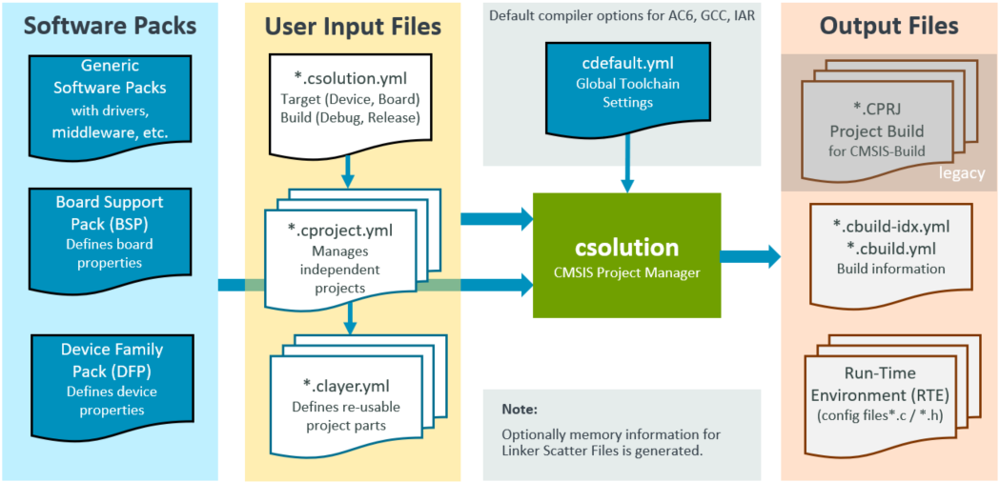

# CMSIS-Toolbox {#mainpage}

The **CMSIS-Toolbox** provides command-line tools for:

- Project creation and build of embedded applications utilizing [Software Packs](https://www.keil.arm.com/packs/) with support for multiple compilation tools.
- Software Pack creation, maintenance, and distribution utilizing the [CMSIS-Pack format](https://open-cmsis-pack.github.io/Open-CMSIS-Pack-Spec/main/html/index.html).

## Access to CMSIS-Toolbox

- [**CMSIS-Toolbox GitHub Repo**](https://github.com/Open-CMSIS-Pack/cmsis-toolbox/releases) - direct access to the release versions for the tools.
- [**vcpkg**](todo) - uses the Arm tools artifactory for consistent installation of development tools.

## Project Creation

The following tools support the creation of build information for embedded applications:

Tool           | Description
:--------------|:-------------
**cpackget**   | **Pack Manager:** install and manage software packs in the development environment.
**csolution**  | **Project Manager:** create build information for embedded applications that consist of one or more related projects.
**cbuild**     | **Build Invocation:** orchestrate the build steps utilizing CMSIS tools and a CMake compilation process.

The build information is defined with **User Input Files** in YAML format. It starts with a `*.csolution.yml` file that refers related, but independent projects defined with `*.cproject.yml` files. A `*.cproject.yml` may refer one or more  `*.clayer.yml` files that define re-usable project parts that may be shared across projects.

The build information can refer to **Software Packs** that define Device and Board information and provide access to re-usable software components such as drivers and middleware.  A `cdefault.yml` file provides a common setup for various compilers and generic translation controls enable compiler agonistic projects; compiler toolchain specific controls may be used when required.

The **Output Files** contain detailed build information and manage the configuration files for software components.

The diagram below provides an overview of the **build information** used by the CMSIS-Toolbox.

### Benefits

- Flexible CLI tools that can be used stand-alone or integrated into [VS Code](https://marketplace.visualstudio.com/items?itemName=Arm.keil-studio-pack) or DevOps systems for Continuous Integration (CI).
- Stand-alone tools that are available for all host platforms (Windows, Mac, Linux) and flexible deployable.
- [Software Packs](https://www.keil.arm.com/packs/) simplify tool setup with `device:` or `board:` selection and project creation with access to reusable software components.
- Organize solutions with projects that are independently managed simplifies a wide range of use cases including  multi-processor applications or unit testing.
- Provisions for product lifecycle management (PLM) with versioned software packs that are easy to update and management for configuration files.
- Software layers enable code reuse across similar applications with a pre-configured set of source files and software components.
- Multiple hardware targets allow application deployment to different hardware (test board, production hardware, virtual hardware, etc.).
- Multiple build types support software testing and verification (debug build, test build, release build, ect.).

## Software Pack Creation

The following tools support the creation of Software Packs in [CMSIS-Pack format](https://open-cmsis-pack.github.io/Open-CMSIS-Pack-Spec/main/html/index.html):

Tool           | Description
:--------------|:-------------
**packchk**    | **Pack Validation:** installs and manages software packs in the local development environment.
**svdconv**    | **SVD Check / Convert:** validate and/or convert System View Description (SVD) files.

In addition several scripts are provided that simplify pack creation with desktop or cloud workflows. This is described in several hands-on tutorials:

Hands-on Tutorial         | Description
:-------------------------|:-------------
[**SW-Pack-HandsOn**](https://github.com/Open-CMSIS-Pack/SW-Pack-HandsOn)    | Explains the steps to create a simple software pack using the Open-CMSIS-Pack technology.
[**DFP-Pack-HandsOn**](https://github.com/Open-CMSIS-Pack/DFP-Pack-HandsOn)  | Explains the structure and creation of a Device Family Pack (DFP).
[**BSP-Pack-HandsOn**](https://github.com/Open-CMSIS-Pack/DFP-Pack-HandsOn)  | Explains the structure and creation of a Board Support Pack (BSP).  

